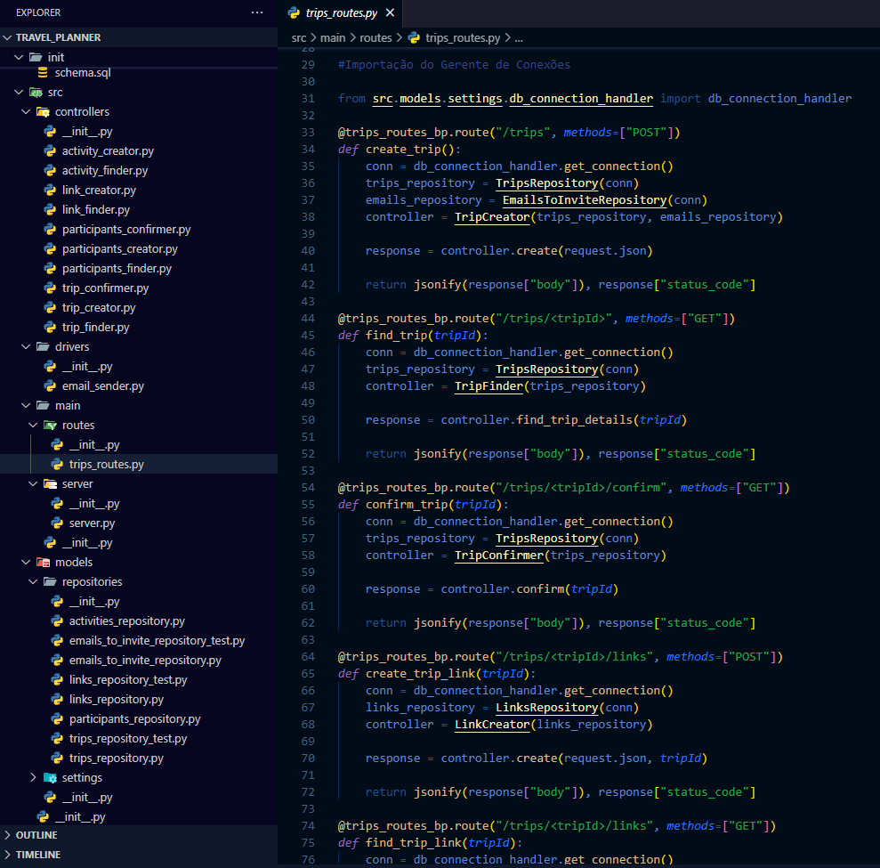

# ✈️ Travel Planner - Back End

Backend de uma aplicação para organização de viagens, com funcionalidades focadas em criação de roteiros, convites e atividades relacionadas a cada viagem.

---

## 🎯 Propósito do Projeto

O projeto tem como objetivo permitir que usuários:

- Criem uma nova viagem
- Enviem convites para participantes da mesma viagem
- Realizem confirmações via e-mail
- Criem atividades vinculadas a cada viagem

---

## 🧪 Tecnologias e Ferramentas Utilizadas

<div align="center">
  
</div>

<br>

- 🐍 **Python** como linguagem principal  
- 🌐 **Flask** como framework web  
- 🗃️ **SQLite** como banco de dados  
- ✅ **Pytest** como biblioteca de testes  

---

## 🚀 Como executar

1. Clone este repositório:
```bash
git clone https://github.com/BrunOliveiraCA/travel_planner.git
```

2. Navegue até o diretório do projeto:
```bash
cd travel_planner
```

3. Crie e ative um ambiente virtual:
```bash
python -m venv venv
source venv/bin/activate  # Linux/Mac
venv\Scripts\activate     # Windows
```

4. Instale as dependências:
```bash
pip install -r requirements.txt
```

5. Execute a aplicação:
```bash
python app.py
```
<br>

## 🧠 Aprendizados
Este projeto demonstra:

Estruturação de um back end com Flask

Integração de banco de dados com SQLite

Gerenciamento de usuários e atividades

Testes automatizados com Pytest

Envio de e-mails simulados para convites e confirmações

<br>

## 📄 Licença
Este projeto está sob a licença MIT. Veja o arquivo LICENSE para mais detalhes.
